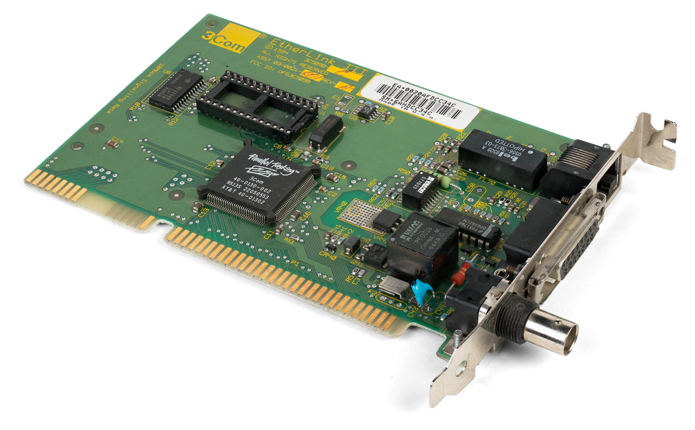

(TL;DR? Download [3C509.COM](3c509.com?raw=true) driver and [3ccfg.exe](3C5x9x/3ccfg.exe?raw=true) configuration).

# 3C509B-nestor
8086 Driver for 3COM Etherlink III 3C509**B** cards 

Here is a driver and a configuration program for the 3C509B family of network interface cards (NICs) which work in IBM PC and XT hardware.

## Quick start

Download:
*[3c509.com Driver](3c509.com?raw=true)
*[3ccfg.exe Configuration](3C5x9x/3ccfg.exe?raw=true))

Use:
```DOS
3ccfg.exe configure /int:3 /optimize:dos /modem:none /pnp:disabled /xcvr:auto
3c509.exe 0x60
```

## History


The widespread and easily available 3COM 3C509B network interface card has been long known to work with computers with a 16-bit ISA bus only. However, that was not because the card couldn't work on an 8-bit ISA bus. The driver software uses assembly opcodes found in the 286 processor, which meant older computers such as the IBM PC and XT with 8088 and 8086 simply couldn't run it.

[Nestor](http://www.vcfed.org/forum/member.php?12204-nestor) a.k.a. [Distwave](http://ibmps1.wordpress.com/) of [VCFed.org](http://www.vcfed.org/) took the time in 2012 to replace all the 286 specific assembly instructions with [generic 8086 code](http://www.vcfed.org/forum/showthread.php?30537-Feeling-lucky-is-the-3c509B-compatible-with-8088-using-NE1000-drivers&p=224266#post224266). Nestor used the packet driver source code from [crynwr.com](http://web.archive.org/web/*/http://www.crynwr.com/drivers/), which was released under the GNU GPL license.

However, while Nestor's driver worked, it required that some cards have their IRQ and other parameters preconfigured on a 286 machine. The 3Com configuration program, 3C5X9CFG.EXE, would die claiming no card was in the machine.  [Predator99](http://www.vcfed.org/forum/showthread.php?30537-Feeling-lucky-is-the-3c509B-compatible-with-8088-using-NE1000-drivers&p=599622#post599622) fixed the problem so it now works on 8088 and 8086 machine. The resulting executable, now called [3ccfg.exe](3C5x9x/3ccfg.exe?raw=true)), has been compressed with PKLITE so that it fits on a single 360K floppy. 

### Purpose of this repository

This repository is mainly meant as a secondary location to hold the
source code for Nestor's modified driver. (For specific changes Nestor
made, look at the history for the file [3c509.asm](3c509.asm)).

The repository also collates parts like the configuration tool and
documentation. Hopefully, having this in version control will also
allow future changes people may make (such as the hack to get it
working on the V20 CPU at full speed) to be incorporated in a clean way.

## Installation

### Configuration

First, download the configuration tool [3ccfg.exe](3C5x9x/3ccfg.exe?raw=true) to configure your 3C509B. If you run it without arguments, it will give you an easy to use menu based system. Or, you can configure everything from the command line, like so:

```
3ccfg.exe configure /int:3 /optimize:dos /modem:none /pnp:disabled /xcvr:auto
```

### Driver
Download [3c509.com](3c509.com?raw=true) to get Ethernet working.
You can run it like
```
3c509.com 0x60
```

### TCP/IP

To get on the Internet, you'll also need software that handles TCP/IP such as [mTCP](https://www.brutman.com/mTCP/). To use mTCP, you need to create a configuration file and then set an environment variable to point to that file.

```DOS
COPY SAMPLE.CFG MTCP.CFG
SET MTCPCFG=A:\MTCP.CFG
```

Once that is done, you can use `DHCP` to get an IP address and `TELNET` to connect to a remote machine.
```DOS
DHCP
TELNET NETHACK.ALT.ORG
```

## Basic Usage
Run the COM file with the software interrupt number: **3C509.COM** _<packet_int_no>_

If you use 0x60, you won't have to edit the mTCP sample file:
```dos
A:\> 3C509.COM 0x60
```
(Note: the README for the driver suggests 0x7e.)

## Advanced Usage of 3C509.COM

According to the source code comments, _<packet_int_no>_'s range is 0x60 to 0x66, 0x68 to 0x6f, and 0x7b to 0x7e.
Why the gaps? 0x67 is the EMS interrupt, 0x70 through 0x77 are used by the second 8259, and 0x7a is used by NetWare's IPX.

If you run the COM file with no parameters, you'll see this message:
```dos
A:\> 3C509.COM
usage: 3c509 [options] <packet_int_no> [id_port]
-i -- Force driver to report itself as IEEE 802.3 instead of Ethernet II.
-d -- Delayed initialization.  Used for diskless booting
-n -- NetWare conversion.  Converts 802.3 packets into 8137 packets
-w -- Windows hack, obsoleted by winpkt
-p -- Promiscuous mode disable
-m -- Micronetics MSM compatibility
-u -- Uninstall
```

## What cards does this work with?

| Card ID                      | Connector Type        | Cable                                    | Works? |
| ---------------------------- | --------------------- | ---------------------------------------- | :----: |
| 3C509B<br/>(3C509B-Coax)     | BNC<br/>AUI           | 10base2<br/>Thick coax                   | Yes    |
| 3C509B-C<br/>(3C509B-COMBO)  | RJ-45<br/>BNC<br/>AUI | 10baseT<br/>10base2<br/>Thick coax       | Yes    |
| 3C509B-TP                    | RJ-45<br/>BNC         | 10baseT<br/>10base2                      | With configuration |
| 3C509B-TPO                   | RJ-45                 | 10baseT                                  | With configuration |

## Software configuration

The 3C509B-**TP** and **TPO** require software configuration before they can be used in a PC or XT as they use IRQ 10 (which didn't exist until the 286). If no NIC is detected by the 3c509.com driver, follow these steps:

1. Run [3CCFG.EXE](3c5x9x/3ccfg.exe?raw=true) (which is a modified-for-8086 version of 3C5X9CFG.EXE, found in [EtherDisk](3c5x9x/3C5X9X.ZIP?raw=true)).
   1. Disable PNP
   1. Set the IRQ to 3 (or another free IRQ, such as 7, see table below)
   1. Optimize for DOS
   1. No modem installed (unless you use a serial port)
   1. If you have an XT-IDE at 0x300, change the Base Address to 0x320.
   1. If you wish, change port transciever (RJ45, BNC, AUI), but the default (AUTO) should work.
1. Save settings to EEPROM.
1. Running `3c509.com 0x60` should now work.


## IRQs
| IRQ | PC/XT Use    | Used by default? | Notes   |
| --- | ------------ | ---------------- | ------- |
| 0   | System Timer | yes | Not wired to ISA bus |
| 1   | Keyboard     | yes | Not wired to ISA bus |
| 2   | Available    |     | Not allowed by 3C5X9CFG |
| 3   | COM2 / COM4  |     |
| 4   | COM1 / COM3  | yes |
| 5   | Hard Disk<br/>Soundcard    |     |
| 6   | Floppy       | yes |
| 7   | Parallel     | yes | Some people remove LPT1 to free this IRQ |

## Factory Defaults

At least for the 3C509B-TP these are the factory default settings:

| Setting                           | Default                | Command line parameter | Possible Values
| --------------------------------- | ---------------------- | ---------------------- | --------------- |
| I/O base address                  | 300H                   | /IOBASE:               | 200..3E0, in increments of 10 |
| Interrupt request level           | 10                     | /INT:                  | 3, 5, 7, 9, 10, 11, 12, 15 |
| Transceiver type                  | auto select            | /XCVR:                 | AUTO, TP, COAX, AUI |
| Network driver optimization       | Windows or OS/2 client | /OPTIMIZE:             | DOS, Windows, OS/2, server |
| Maximum interrupt disable time    | 500 microseconds       | /MODEM:                | 25-1600, in increments of 25ms, or use<br/>None, 1200, 2400, 9600, 19200, 38400 |
| Plug and Play Capability          | enabled                | /PNP:                  | ENABLED, DISABLED |
| Full duplex                       | disabled               | /FULLDUPLEX:           | ENABLED, DISABLED |
| Boot PROM Size                    | disabled               | /BSIZE:                | 8,16,32,disabled |       
| Boot PROM Address                 | D0000h                 | /BADDRESS:             | C2000-DE000      |       
| Link beat (pre-10base-T only)     | disabled               | /LINKBEAT:             | disabled, enabled |
| Configuration & Diagnostic Port<br/>(Do not change unless another device is on address 110)  | 110                    | /CONFIGPORT:           | 100-1E0, in increments of 10 |
| Insert wait state each bus cycle<br/>(Allows NIC to work in computers with marginal ISA I/O bus timing)  | disabled               | /SYNCREADY:            | disabled, enabled |


## Suggested setting

If not using a serial port, I suggest the following command:

```
3CCFG.EXE CONFIGURE /int:3 /optimize:dos /modem:none /pnp:disabled /xcvr:auto
```

A serial card may drop bytes if the 3C509B doesn't give up the bus frequently enough to allow other IRQs to be handled. Note that if your serial card has a 16**5**50 UART, you can also use `/modem:none` as it will buffer bytes in the FIFO. If you use a serial card with the older 8250 (or 16**4**50 UART), use `/modem:9600`, or whatever baud rate you use your serial port at. The lower the baud, the better your Ethernet performance will be. 


## Probably irrelevant BIOS bug

This likely won't affect you, but I'm documenting it just in case.

### 3CCFG /PNPRST; 3CCFG CONFIGURE /PNP:DISABLED

If you are still unable to run the configuration program due to "No Adapter Found", it may be because of a strange BIOS quirk which puts the NIC into an infinite loop trying to negotiate PNP. If the 3C509.EXE driver can't find your card either, that might be a tip that this is the problem.

According to archive.org's cache of 3com.com's [FAQ](http://web.archive.org/web/20060314235414/http://support.3com.com/infodeli/inotes/techtran/2406_5ea.htm), when the "No Etherlink III Adapter Found" error is seen, one should run the following and reboot:
```
3C5X9CFG /PNPRST
3C5X9CFG CONFIGURE /PNP:DISABLED
```

Of course, since we are using the 8086 version, you would replace 3C5X9CFG with `3CCFG`.

### Commentary on BIOS bug

Here is the commentary on the BIOS bug from [EtherDisk V4.3b](3c5x9x/3C5X9X.ZIP?raw=true):

> Installing an EtherLink III ISA adapter (3C509B) in certain computers
 may result in neither the diagnostic and configuration program nor the
 driver being able find the adapter. The problem is your computer's BIOS is
 issuing a series of I/O instructions that causes the 3C509B to think it's
 going to be activated as a Plug 'N Play (PnP) device.  Unfortunately, the
 adapter waits for the PnP series to complete and ignores the "classic" or
 "legacy" method for discovering an EtherLink III ISA adapter.  The fix for
 this problem is very simple; follow the steps below:
> 1. Boot a minimal DOS setup, making sure that no EtherLink III drivers are loaded.
> 2. Put this EtherDisk in the diskette drive and type A: at the DOS prompt.
> 3.  Enter PNPDSABL [_which is just a BAT file that executes the two
      [3C5X9CFG](3c5x9x/3C5X9CFG.EXE?raw=true) commands above_]
      at the DOS prompt.  The configuration and diagnostic
      program will execute twice.  The first time it executes, the configuration
      and diagnostic program "kicks" the EtherLink III out of its PnP wait.
      During the second execution, it disables Plug 'n Play. The final message
      displayed will be:
        "The 3C5X9 adapter, adapter number 1, was successfully configured"
> 4. Finally, remove the EtherDisk from the diskette drive, and turn the
      computer power off, then on.


